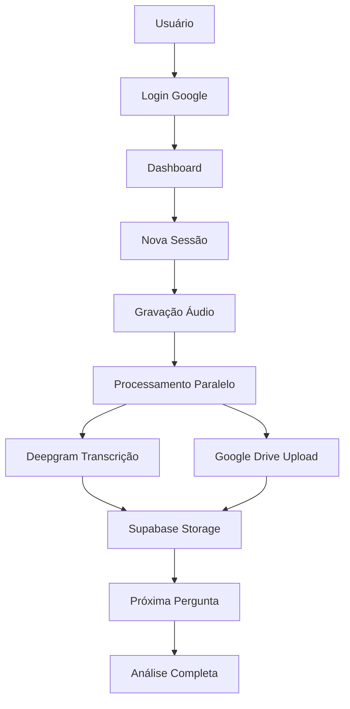

# DNA - Deep Narrative Analysis Platform

Uma plataforma SaaS robusta para análise narrativa profunda, construída com Next.js, Supabase, e integração com serviços de IA.

## 🎯 Visão Geral

A plataforma DNA evoluiu de um protótipo para uma solução empresarial completa que oferece:

- **Autenticação segura** com Google OAuth
- **Análise narrativa interativa** com gravação de áudio
- **Transcrição automática** usando Deepgram AI
- **Armazenamento seguro** no Google Drive
- **Banco de dados robusto** com Supabase PostgreSQL
- **Interface responsiva** e acessível

## 🏗️ Arquitetura

### Stack Tecnológico

- **Frontend/Backend**: Next.js 14 (App Router)
- **Autenticação**: NextAuth.js com Google Provider
- **Banco de Dados**: Supabase (PostgreSQL)
- **Armazenamento**: Google Drive API
- **Transcrição**: Deepgram API
- **Deploy**: Netlify
- **Styling**: Tailwind CSS + CSS Modules

### Fluxo de Dados



## 🚀 Configuração Rápida

### 1. Pré-requisitos

- Node.js 18+
- Conta no Supabase
- Projeto no Google Cloud Platform
- Conta no Deepgram
- Conta no Netlify

### 2. Instalação

```bash
# Clone o repositório
git clone https://github.com/seu-usuario/dna3.git
cd dna3

# Instale as dependências
npm install

# Configure as variáveis de ambiente
cp .env.example .env.local
# Edite .env.local com suas credenciais
```

### 3. Configuração do Banco de Dados

1. Acesse seu projeto no Supabase
2. Vá para SQL Editor
3. Execute o script `database-schema.sql`

### 4. Configuração dos Serviços

#### Supabase
```bash
# No painel do Supabase > Settings > API
NEXT_PUBLIC_SUPABASE_URL=https://seu-projeto.supabase.co
NEXT_PUBLIC_SUPABASE_ANON_KEY=sua_chave_publica
SUPABASE_SERVICE_ROLE_KEY=sua_chave_service_role
```

#### Google Cloud Platform
```bash
# Console > APIs & Services > Credentials
GOOGLE_CLIENT_ID=seu_client_id.apps.googleusercontent.com
GOOGLE_CLIENT_SECRET=seu_client_secret
```

#### Deepgram
```bash
# Dashboard > API Keys
DEEPGRAM_API_KEY=sua_chave_deepgram
```

#### NextAuth
```bash
# Gere uma chave secreta
openssl rand -base64 32
NEXTAUTH_SECRET=resultado_do_comando_acima
NEXTAUTH_URL=https://seu-app.netlify.app
```

### 5. Deploy

```bash
# Build local para testar
npm run build
npm start

# Deploy no Netlify
# 1. Conecte seu repositório GitHub ao Netlify
# 2. Configure as variáveis de ambiente no painel
# 3. Deploy automático será ativado
```

## 📁 Estrutura do Projeto

```
src/
├── app/                    # App Router do Next.js
│   ├── api/               # API Routes
│   │   ├── auth/          # NextAuth endpoints
│   │   ├── sessions/      # Gerenciamento de sessões
│   │   ├── transcribe/    # Transcrição autenticada
│   │   └── guest-transcribe/ # Transcrição para convidados
│   ├── auth/              # Páginas de autenticação
│   ├── dashboard/         # Dashboard do usuário
│   ├── analysis/          # Interface de análise
│   ├── guest-analysis/    # Análise para não-autenticados
│   └── layout.tsx         # Layout raiz
├── components/            # Componentes reutilizáveis
├── lib/                   # Utilitários e configurações
│   ├── supabase.ts       # Cliente Supabase
│   ├── config.ts         # Perguntas e configurações
│   └── types.ts          # Tipos TypeScript
└── services/             # Serviços externos
    ├── googleDriveService.ts
    └── webAudioService.ts
```

## 🔐 Segurança

### Row Level Security (RLS)

O banco de dados utiliza RLS para garantir que:
- Usuários só acessem seus próprios dados
- Sessões sejam isoladas por usuário
- Políticas automáticas de limpeza

### Autenticação

- JWT tokens seguros com NextAuth.js
- Cookies HttpOnly e Secure
- Validação de sessão em todas as rotas protegidas

### Armazenamento

- Arquivos organizados por usuário no Google Drive
- Chaves de API protegidas em variáveis de ambiente
- Criptografia em trânsito e em repouso

## 🎨 Interface do Usuário

### Páginas Principais

1. **Landing Page** (`/`)
   - Apresentação da plataforma
   - Opções de login ou acesso como convidado

2. **Dashboard** (`/dashboard`)
   - Visão geral das sessões
   - Estatísticas do usuário
   - Acesso ao histórico

3. **Análise** (`/analysis`)
   - Interface interativa de perguntas
   - Gravação e transcrição em tempo real
   - Progresso visual

4. **Análise Convidado** (`/guest-analysis`)
   - Versão simplificada sem persistência
   - Experiência completa de demonstração

### Componentes Visuais

- **Partículas flutuantes** para ambiente imersivo
- **Visualizador de áudio** responsivo
- **Indicadores de progresso** circulares
- **Feedback visual** para cada estado da aplicação

## 🔧 Desenvolvimento

### Scripts Disponíveis

```bash
npm run dev          # Servidor de desenvolvimento
npm run build        # Build de produção
npm run start        # Servidor de produção
npm run lint         # Verificação de código
```

### Variáveis de Ambiente

Consulte `.env.example` para a lista completa de variáveis necessárias.

### Debugging

- Logs detalhados em desenvolvimento
- Error boundaries para captura de erros
- Monitoring de performance com Next.js

## 📊 Monitoramento

### Métricas Importantes

- Taxa de conclusão de sessões
- Tempo médio por pergunta
- Qualidade das transcrições
- Uso de armazenamento

### Logs

- Erros de API no Netlify Functions
- Métricas de uso no Supabase
- Status de uploads no Google Drive

## 🔄 Manutenção

### Rotação de Segredos

Recomenda-se rotacionar as seguintes chaves a cada 6 meses:
- `NEXTAUTH_SECRET`
- `SUPABASE_SERVICE_ROLE_KEY`
- `GOOGLE_DRIVE_ADMIN_REFRESH_TOKEN`

### Limpeza de Dados

Execute periodicamente no Supabase:
```sql
SELECT cleanup_incomplete_sessions(30); -- Remove sessões incompletas > 30 dias
```

### Backup

- Supabase: Backups automáticos diários
- Google Drive: Redundância nativa
- Código: Versionamento no Git

## 🚀 Próximos Passos

### Funcionalidades Planejadas

1. **Painel Administrativo**
   - Visualização de todas as sessões
   - Análise de dados agregados
   - Relatórios de uso

2. **Análise Avançada**
   - Processamento de linguagem natural
   - Identificação de padrões
   - Relatórios personalizados

3. **Integrações**
   - Webhook para sistemas externos
   - API pública para desenvolvedores
   - Exportação de dados

4. **Melhorias UX**
   - Modo offline
   - Aplicativo mobile
   - Acessibilidade aprimorada

## 🤝 Contribuição

1. Fork o projeto
2. Crie uma branch para sua feature (`git checkout -b feature/AmazingFeature`)
3. Commit suas mudanças (`git commit -m 'Add some AmazingFeature'`)
4. Push para a branch (`git push origin feature/AmazingFeature`)
5. Abra um Pull Request

## 📄 Licença

Este projeto está licenciado sob a MIT License - veja o arquivo [LICENSE](LICENSE) para detalhes.

## 🆘 Suporte

Para suporte técnico:
- 📧 Email: suporte@dna-analysis.com
- 📚 Documentação: [docs.dna-analysis.com](https://docs.dna-analysis.com)
- 🐛 Issues: [GitHub Issues](https://github.com/seu-usuario/dna3/issues)

---

**DNA - Deep Narrative Analysis Platform**  
*Transformando narrativas em insights profundos*